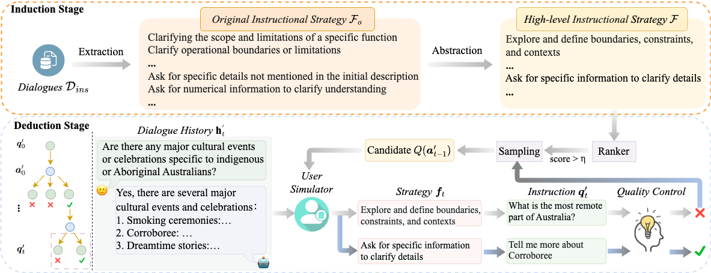

# [EMNLP 2024 Main Conference] Inductive-Deductive Strategy Reuse for Multi-Turn Instructional Dialogues

This project includes the data and code for paper[📄Inductive-Deductive Strategy Reuse for Multi-Turn Instructional Dialogues](https://arxiv.org/pdf/2404.11095.pdf)

----------

## Abstract
Aligning large language models (LLMs) with human expectations requires high-quality instructional dialogues, which usually require instructions that are diverse and in-depth. 
Existing methods leverage two LLMs to interact for automatic collection: one simulating a user to pose instructions, and the other acting as a system agent to respond. 
However, these user simulators struggle to model the rules behind how dialogues can pose different instructions without explicit guidance, resulting in general instructions. 
In this paper, we propose to explicitly capture the complex rules to help the user simulator pose diverse and in-depth instruction. 
Specifically, we first induce high-level instruction strategies from various real instruction dialogues serving as rules. 
Afterward, different possible strategies are applied to the newly given dialogue scenario deductively to pose various instructions. 
Experimental results show that our method can generate diverse and in-depth instructions. The constructed multi-turn instructional dialogues can outperform competitive baselines on the downstream chat model.

## Architecture


## Getting Started

We place the data which used to train the user simulator and chat model in Hugging Face：https://huggingface.co/datasets/wujiayu/IDEAS
### Induction

#### Oringinal Instructional Strategies Extraction
``` 
cd induction
python strategy_extraction.py.py --data_path [data_path] --save_path [save_path]
``` 

#### High-level Instructional Strategies Abstraction
To cluster similar strategies:
```
cd induction
python sbert_for_similarity.py --model_path [model_path] --data_path [data_path]
```
To abstract the strategies within each cluster 
```
python strategy_abstraction.py --data_path [data_path] --save_path [save_path] --embedding_cache_path[--embedding_cache_path] --save_path[--save_path]
``` 


#### User Simulator Training
We provide training code to fine-tune LLaMa-2. You need to prepare the base model (LLaMa-2 or other models you like) and run the following training script. It should take 5-6 hours to train on 64 A100 GPUs.
```
# to fine-tune a user simulator
cd induction/
bash run_user_simulator.sh
```

### Deduction

#### Inferencing
```
cd deduction/
CUDA_VISIBLE_DEVICES=0 python infer.py "model_name_or_path" "tokenizer_path" 4096 "./data/infer_p_chat_sharegpt_10k.json"  "category_path" "./data/output/infer_gpt4_reward_model_10k"
```
#### Chat Model Training
We provide training code to fine-tune LLaMa-2. You need to prepare the base model (LLaMa-2 or other models you like) and run the following training script. It should take 2.5 hours to train on 1 A100 GPUs. 
```
# to fine-tune a chat model
cd deduction/
bash run_chat_model.sh
```
## Citation
```
@misc{ou2024inductivedeductive,
      title={Inductive-Deductive Strategy Reuse for Multi-Turn Instructional Dialogues}, 
      author={Jiao Ou and Jiayu Wu and Che Liu and Fuzheng Zhang and Di Zhang and Kun Gai},
      year={2024},
      eprint={2404.11095},
      archivePrefix={arXiv},
      primaryClass={cs.CL}
}
```
